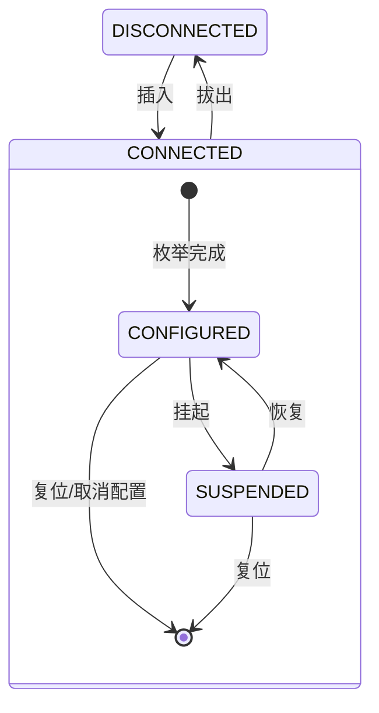

# Zephyr 异步串口例程

这是一个基于 Zephyr RTOS 的异步串口通信示例工程，实现了串口数据的接收、解析和回环发送功能。

## 功能概述

- 串口异步收发数据
- CRLF协议解析 (以`\r\n`结尾的数据包)
- 数据回环 (loopback) 功能
- 完整的错误处理和内存管理
- RX/TX 线程与消息队列
- 低功耗休眠/唤醒（按键）
- 通过异步串口 API 操作 USB CDC ACM

## 硬件支持

- nRF52DK (nRF52832)
- nRF52840DK
- nRF5340DK (CPUAPP / CPUAPP NS)
- nRF54L15DK
- nRF54LM20DK (nRF54LM20A)
- nRF9151DK (NS)
- nRF9160DK (NS)

## 主要文件结构

```
src/
├── main.c              # 主应用程序
├── app_uart/
│   ├── app_uart.c      # 串口驱动封装
│   └── app_uart.h      # 串口API接口
├── app_usb/
│   ├── app_usb.c       # USB CDC ACM 初始化
│   ├── app_usb_callback.c # USB SMF 状态机
│   └── app_usb.h       # USB API接口
└── ...
```

## 串口使用说明

### 1. 包含头文件
```c
#include "app_uart.h"
```

### 2. 在main函数中注册数据接收回调函数
```c
static void uart_callback(uint8_t *byte, size_t len)
{
    // 处理接收到的数据
    for (size_t i = 0; i < len; i++) {
        bytes_to_packet(byte[i]);  // 协议解析
    }
}

int main()
{
    int err;
    
    LOG_INF("Starting UART application");
    
    // 注册数据接收回调函数
    err = app_uart_rx_cb_register(uart_callback);
    if (err) {
        LOG_ERR("Failed to register RX callback: %d", err);
        return err;
    }
    
    LOG_INF("UART application initialized successfully");
    k_sleep(K_FOREVER);
    return 0;
}
```

### 3. 发送数据
```c
uint8_t data[] = "Hello World\r\n";
int err = app_uart_tx(data, sizeof(data));
if (err) {
    LOG_ERR("Send failed: %d", err);
}
```

## 协议包解析

工程实现了简单的CRLF协议：
- 数据以 `\r\n` 结尾表示一个完整数据包
- 使用状态机解析字节流
- 收到完整数据包后自动回环发送

## 编译和运行

### UART 模式（默认）

1. 构建工程：
```bash
west build -p -d build -b nrf52840dk/nrf52840
```

2. 烧录固件：
```bash
west flash
```

3. 使用串口工具连接设备，波特率115200

4. 发送以`\r\n`结尾的数据，观察回环效果

5. 串口低功耗休眠测试：

    - 按 button1 进入休眠
    - 按 button2 退出休眠

### USB CDC ACM 模式（可选）

使用 `prj_usb.conf` + `usb.overlay` 启用 USB CDC ACM 与异步适配器。

```bash
west build -p -d build_usb -b nrf52840dk/nrf52840 -- -DCONF_FILE="prj_usb.conf" -DDTC_OVERLAY_FILE="usb.overlay"
```

其他板子的 USB 编译示例：

```bash
west build -p -d build_usb_5340 -b nrf5340dk/nrf5340/cpuapp -- -DCONF_FILE="prj_usb.conf" -DDTC_OVERLAY_FILE="usb.overlay"
west build -p -d build_usb_54lm20 -b nrf54lm20dk/nrf54lm20a/cpuapp -- -DCONF_FILE="prj_usb.conf" -DDTC_OVERLAY_FILE="usb.overlay"
```

### USB 状态机

USB 通过状态机管理。CONNECTED 是父状态并包含子状态，DISCONNECTED 为低功耗状态。
Zephyr SMF 先执行子状态回调；如果子状态返回 `SMF_EVENT_HANDLED`，父状态回调不会再执行。



## 注意事项

### 外设引脚跨域分配

54L15的GPIO和外设位于不同电源域（Power Domain）时，一定要严格按照[手册中的引脚分配表格指定引脚](https://docs.nordicsemi.com/bundle/ps_nrf54L15/page/chapters/pin.html#d380e188)进行分配。并且，在使用外设的时间内，还需要开启[CPU的constant latency mode](https://docs.nordicsemi.com/bundle/ps_nrf54L15/page/pmu.html#ariaid-title3)。当使用 nRF54L 的 UART20/21/22 并搭配 GPIO P2 时，请使能 `CONFIG_APP_UART_GPIO_CROSS_DOMAIN`。

## 博客

- [Zephyr驱动与设备树实战——串口](https://www.cnblogs.com/jayant97/articles/17828907.html)

  
