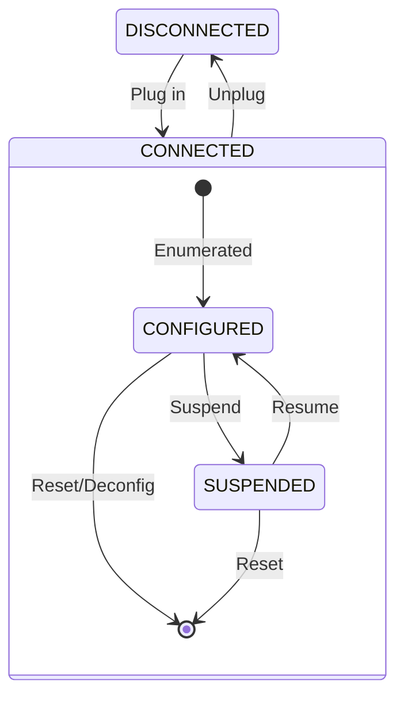

# Async UART example for Zephyr

[中文说明](https://github.com/Jayant-Tang/learning_zephyr_serial/blob/master/README-CN.md)

This is an async UART communication example project based on Zephyr RTOS, implementing serial data reception, parsing, and loopback transmission functionality.

## Features

- Asynchronous UART data transmission and reception
- CRLF protocol parsing (packets ending with `\r\n`)
- Data loopback functionality
- Complete error handling and memory management
- RX/TX worker threads with message queues
- Low power sleep/wakeup via DK buttons
- Optional USB CDC ACM backend via async adapter

## Hardware Support

- nRF52DK (nRF52832)
- nRF52833DK
- nRF52840DK
- nRF5340DK (CPUAPP / CPUAPP NS)
- nRF54L15DK
- nRF54LM20DK (nRF54LM20A)
- nRF9151DK (NS)
- nRF9160DK (NS)

## Project Structure

```
src/
├── main.c              # Main application
├── app_uart/
│   ├── app_uart.c      # UART driver wrapper
│   └── app_uart.h      # UART API interface
├── app_usb/
│   ├── app_usb.c       # USB CDC ACM setup
│   ├── app_usb_callback.c # USB SMF state machine
│   └── app_usb.h       # USB API interface
└── ...
```

## UART Usage Guide

### 1. Include Header Files
```c
#include "app_uart.h"
```

### 2. Register Data Reception Callback in Main Function
```c
static void uart_callback(uint8_t *byte, size_t len)
{
    // Process received data
    for (size_t i = 0; i < len; i++) {
        bytes_to_packet(byte[i]);  // Protocol parsing
    }
}

int main()
{
    int err;
    
    LOG_INF("Starting UART application");
    
    // Register data reception callback function
    err = app_uart_rx_cb_register(uart_callback);
    if (err) {
        LOG_ERR("Failed to register RX callback: %d", err);
        return err;
    }
    
    LOG_INF("UART application initialized successfully");
    k_sleep(K_FOREVER);
    return 0;
}
```

### 3. Send Data
```c
uint8_t data[] = "Hello World\r\n";
int err = app_uart_tx(data, sizeof(data));
if (err) {
    LOG_ERR("Send failed: %d", err);
}
```

## Protocol Packet Parsing

The project implements a simple CRLF protocol:
- Data ending with `\r\n` represents a complete packet
- Uses FSM to parse byte streams
- Automatically sends loopback after receiving complete packets

## Build and Run

### UART Mode (default)

1. Build the project:
```bash
west build -p -d build -b nrf52840dk/nrf52840
```

2. Flash firmware:
```bash
west flash -d build
```

3. Connect to the device using a serial tool with baud rate 115200

4. Send data ending with `\r\n` and observe the loopback effect

5. UART low-power sleep test:

    - Press button1 to enter sleep mode
    - Press button2 to exit sleep mode

### USB CDC ACM Mode (optional)

1. Build the project:
   Use `prj_usb.conf` + `usb.overlay` to enable USB CDC ACM and the async adapter.
   
   ```bash
   # nRF52840DK
   west build -p -d build_usb -b nrf52840dk/nrf52840 -- -DCONF_FILE="prj_usb.conf" -DDTC_OVERLAY_FILE="usb.overlay"
   
   # nRF52833DK
   west build -p -d build_usb_52833 -b nrf52833dk/nrf52833 -- -DCONF_FILE="prj_usb.conf" -DDTC_OVERLAY_FILE="usb.overlay"
   
   # nRF5340DK CPUAPP without TFM
   west build -p -d build_usb_5340 -b nrf5340dk/nrf5340/cpuapp -- -DCONF_FILE="prj_usb.conf" -DDTC_OVERLAY_FILE="usb.overlay"
   
   # nRF54LM20DK nRF54LM20A
   west build -p -d build_usb_54lm20 -b nrf54lm20dk/nrf54lm20a/cpuapp -- -DCONF_FILE="prj_usb.conf" -DDTC_OVERLAY_FILE="usb.overlay"
   ```

2. Flash firmware:
   ```bash
   west flash -d build_usb
   ```

3. Connect to the device "Async Serial" using a serial tool with any baud rate.

4. Send data ending with `\r\n` and observe the loopback effect.

5. Unplugging USB puts the device into low power mode; plugging it in exits low power mode.

   - Button operations are disabled in USB mode.

### USB State Machine

USB is managed by a simple state machine. CONNECTED is the parent state with child substates, and DISCONNECTED is the low-power state.
Zephyr SMF runs child state handlers first; if a child returns `SMF_EVENT_HANDLED`, the parent handler will not run for that event.



## Important Notes

### Peripheral Pin Cross-Domain Assignment

For the nRF54L series, using peripherals in the PERI power domain (such as UART20/21/22) with GPIO Port 2 is a cross-domain use case. Follow these requirements:

1. Strictly follow the [pin assignment table specified in the manual](https://docs.nordicsemi.com/bundle/ps_nrf54L15/page/chapters/pin.html#d380e188).
2. While the peripheral is active, enable the [CPU constant latency mode](https://docs.nordicsemi.com/bundle/ps_nrf54L15/page/pmu.html#ariaid-title3):
    - Enable `CONFIG_NRF_SYS_EVENT=y`.
    - Call `nrf_sys_event_request_global_constlat()` before using the peripheral and `nrf_sys_event_release_global_constlat()` after finishing.

Reference: https://docs.nordicsemi.com/bundle/ncs-latest/page/nrf/app_dev/device_guides/nrf54l/pinmap.html

## Blog Reference

- [Zephyr Driver and Device Tree Practice - UART (Chinese)](https://www.cnblogs.com/jayant97/articles/17828907.html)

  
